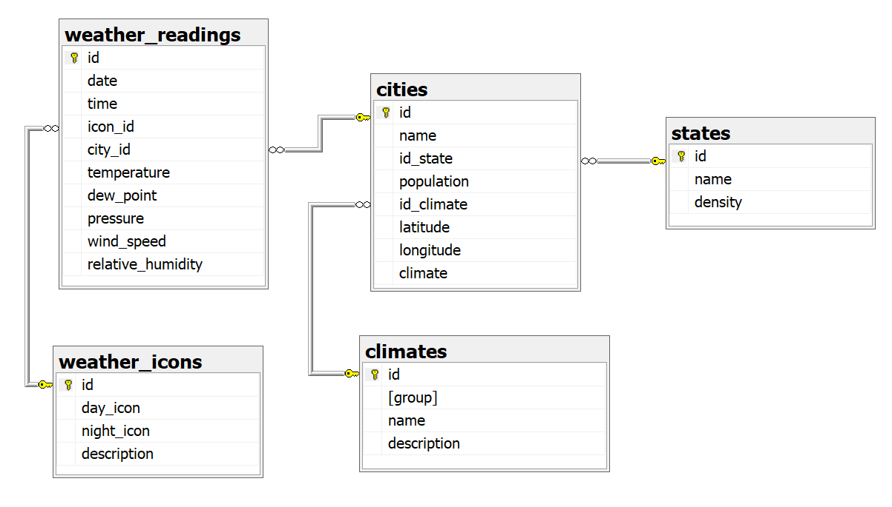

# **Weather Lookback Project**

## **Description**
This data analysis project compares current weather conditions to historical data in the past 30 years. My intention is to show elementary tools and procesess that are used in a daily workflow. We first perform an ETL(Extract, Transform, Load) process and then we use the cleaned data to create an interactive dashboard in Power BI. 

## **Limitations**
-  This is a POC (Proof of Concept) and will be limited to weather readings in Mexico. Specifically, we are interested in saving new data for the cities of Nayarit, Mexico City, and Querétaro. 

-  We will only consider the variables of date, time, temperature, wind speed, pressure, dew point, and humidity. 

-  The historical data spans from 1994 to the present and is restricted to the nearest weather station within the city. 

## **Snapshots**  

## **Sources**  

-   https://www.inegi.org.mx
-   https://dev.meteostat.net
-   https://openweathermap.org/

